<p align="right">English | <a href="docs/README_CN.md">简体中文</a></p>

<p align="center">
  
  
  <h3 align="center"><strong>Segment Any Point Cloud Sequences by Distilling Vision Foundation Models</strong></h3>

  <p align="center">
    <a href="https://github.com/youquanl">Youquan Liu</a><sup>1,*</sup>&nbsp;
    <a href="https://ldkong.com">Lingdong Kong</a><sup>1,2,*</sup>&nbsp;
    <a href="http://cen-jun.com">Jun Cen</a><sup>3</sup>&nbsp;
    <a href="https://scholar.google.com/citations?user=Uq2DuzkAAAAJ">Runnan Chen</a><sup>4</sup>&nbsp;
    <a href="http://zhangwenwei.cn">Wenwei Zhang</a><sup>1,5</sup>&nbsp;
    <a href="https://scholar.google.com/citations?user=lSDISOcAAAAJ">Liang Pan</a><sup>5</sup>&nbsp;
    <a href="http://chenkai.site">Kai Chen</a><sup>1</sup>&nbsp;
    <a href="https://liuziwei7.github.io">Ziwei Liu</a><sup>5</sup>&nbsp;
    <br>
    <sup>1</sup>Shanghai AI Laboratory&nbsp;&nbsp;&nbsp;
    <sup>2</sup>NUS&nbsp;&nbsp;&nbsp;
    <sup>3</sup>HKUST&nbsp;&nbsp;&nbsp;
    <sup>4</sup>HKU&nbsp;&nbsp;&nbsp;
    <sup>5</sup>S-Lab, NTU
  </p>

</p>

<p align="center">
  <a href="https://arxiv.org/abs/2306.09347" target='_blank'>
    
  </a>
  
  <a href="https://ldkong.com/Seal" target='_blank'>
    
  </a>
  
  <a href="https://youtu.be/S0q2-nQdwSs" target='_blank'>
    
  </a>
  
  <a href="" target='_blank'>
    
  </a>
  
  <a href="" target='_blank'>
    
  </a>
</p>


# Seal :seal:
`Seal` is a versatile self-supervised learning framework capable of segmenting *any* automotive point clouds by leveraging off-the-shelf knowledge from vision foundation models (VFMs) and encouraging spatial and temporal consistency from such knowledge during the representation learning stage.

<p align="center">
  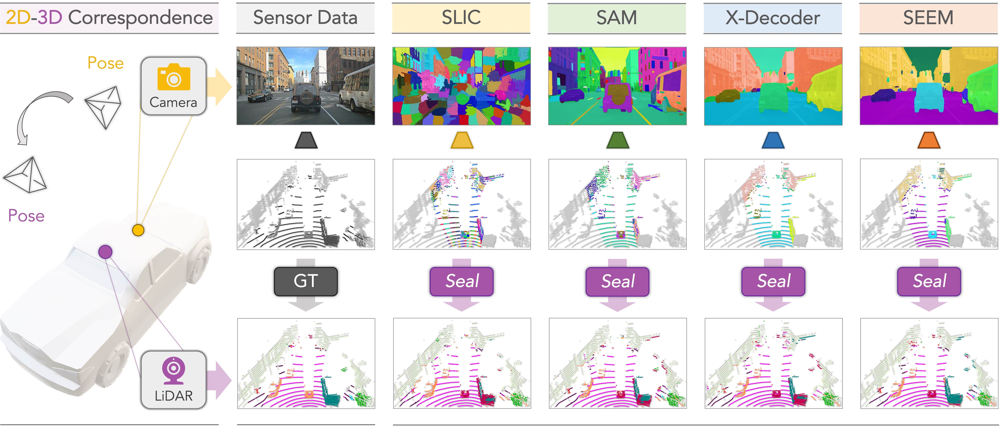
</p>

### :sparkles: Highlight
- :rocket: **Scalability:** `Seal` directly distills the knowledge from VFMs into point clouds, eliminating the need for annotations in either 2D or 3D during pretraining.
- :balance_scale: **Consistency:** `Seal` enforces the spatial and temporal relationships at both the camera-to-LiDAR and point-to-segment stages, facilitating cross-modal representation learning.
- :rainbow: **Generalizability:** `Seal` enables knowledge transfer in an off-the-shelf manner to downstream tasks involving diverse point clouds, including those from real/synthetic, low/high-resolution, large/small-scale, and clean/corrupted datasets.

### :oncoming_automobile: 2D-3D Correspondence
<p align="center">
  
</p>


### :movie_camera: Video Demo
| Demo 1 | Demo 2| Demo 3|
| :-: | :-: | :-: |
| 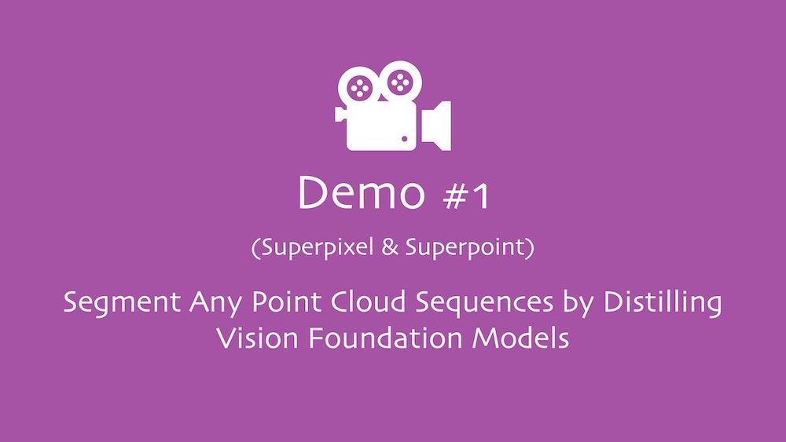 | 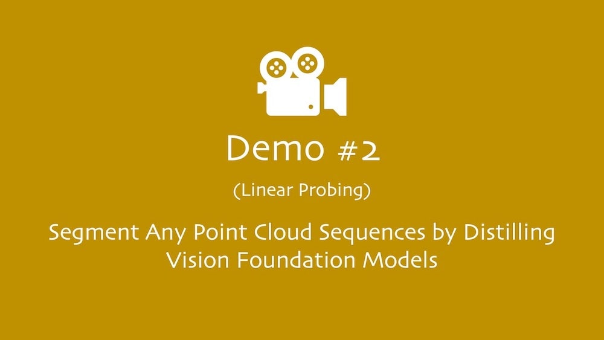 | 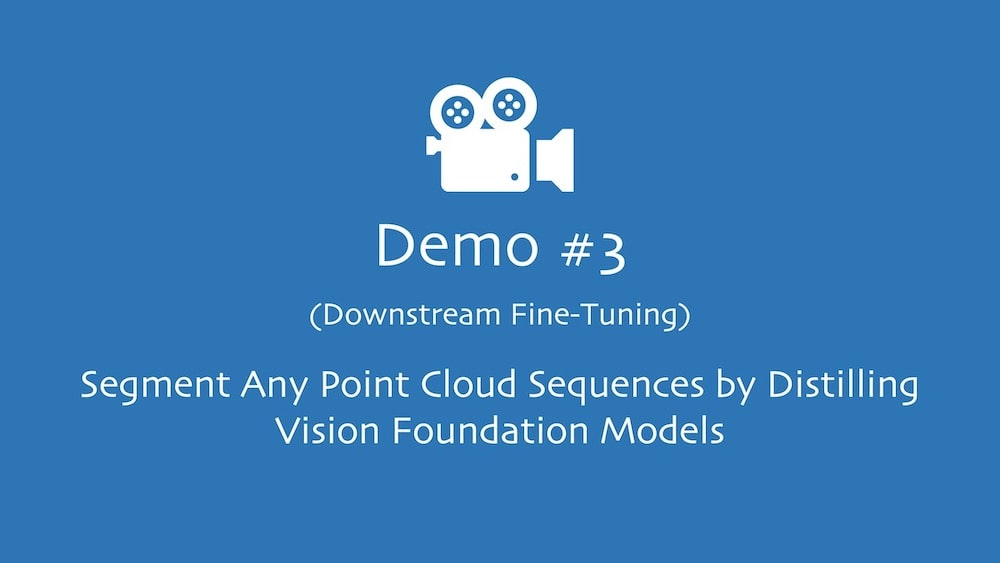 | 
| [Link](https://youtu.be/S0q2-nQdwSs) <sup>:arrow_heading_up:</sup> | [Link](https://youtu.be/yoon3uiRnY8) <sup>:arrow_heading_up:</sup> | [Link]() <sup>:arrow_heading_up:</sup> |


## Updates
- \[2023.06\] - Our paper is available on arXiv, click [here](https://arxiv.org/abs/2306.09347) to check it out. Code will be available later!
- \[2023.07\] - You can explore superpixel generation codes by clicking [here](docs/document/SUPERPOINT.md).


## Outline
- [Installation](#installation)
- [Data Preparation](#data-preparation)
- [Getting Started](#getting-started)
- [Main Result](#main-result)
- [TODO List](#todo-list)
- [License](#license)
- [Acknowledgement](#acknowledgement)
- [Citation](#citation)


## Installation
Please refer to [INSTALL.md](docs/document/INSTALL.md) for the installation details.


## Data Preparation

| [**nuScenes**](https://www.nuscenes.org/nuscenes) | [**SemanticKITTI**](http://semantic-kitti.org/) | [**Waymo Open**](https://waymo.com/open) | [**ScribbleKITTI**](https://github.com/ouenal/scribblekitti) |
| :-: | :-: | :-: | :-: |
| 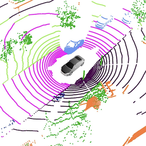 | 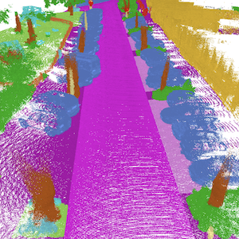 | 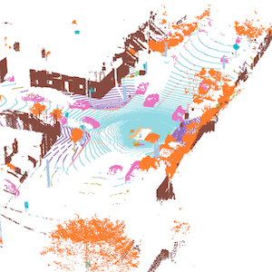 | 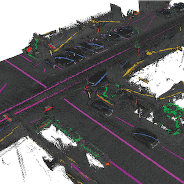 | 
| [**RELLIS-3D**](http://www.unmannedlab.org/research/RELLIS-3D) | [**SemanticPOSS**](http://www.poss.pku.edu.cn/semanticposs.html) | [**SemanticSTF**](https://github.com/xiaoaoran/SemanticSTF) | [**DAPS-3D**](https://github.com/subake/DAPS3D) |
| 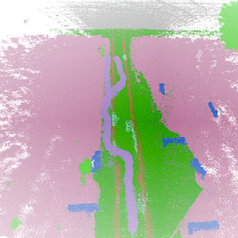 | 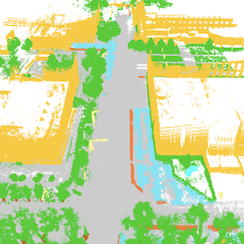 | 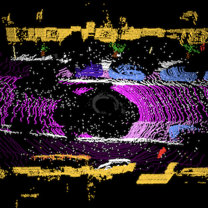 | 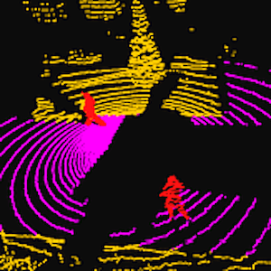 | 
| [**SynLiDAR**](https://github.com/xiaoaoran/SynLiDAR) | [**Synth4D**](https://github.com/saltoricristiano/gipso-sfouda) | [**nuScenes-C**](https://github.com/ldkong1205/Robo3D) |
| 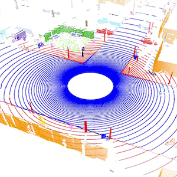 | 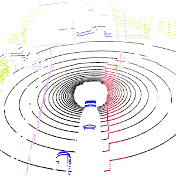 | 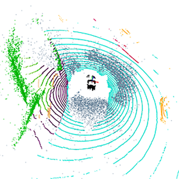 |

Please refer to [DATA_PREPARE.md](docs/document/DATA_PREPARE.md) for the details to prepare these datasets.


## Superpoint Generation

| Raw Point Cloud | Semantic Superpoint | Groundtruth |
| :-: | :-: | :-: |
| 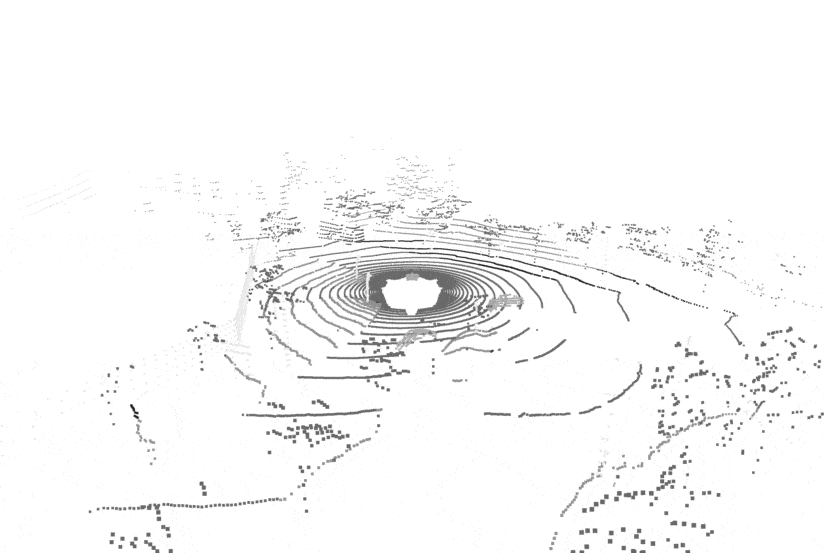 | 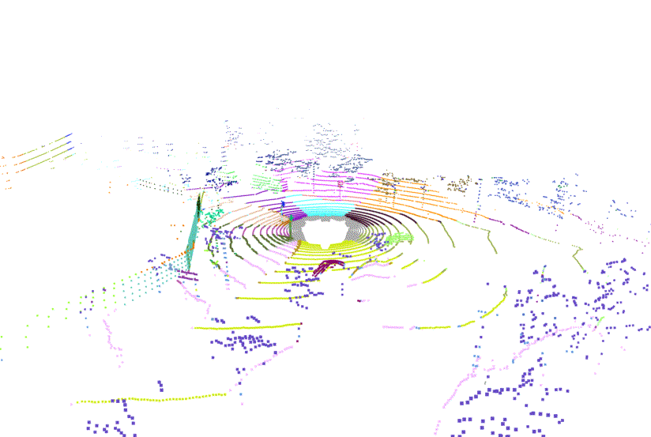 | 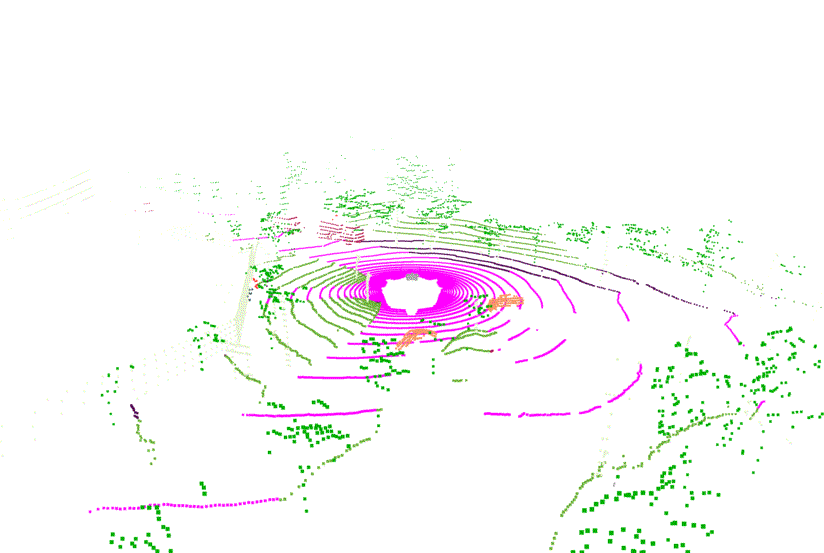 | 
| |
| 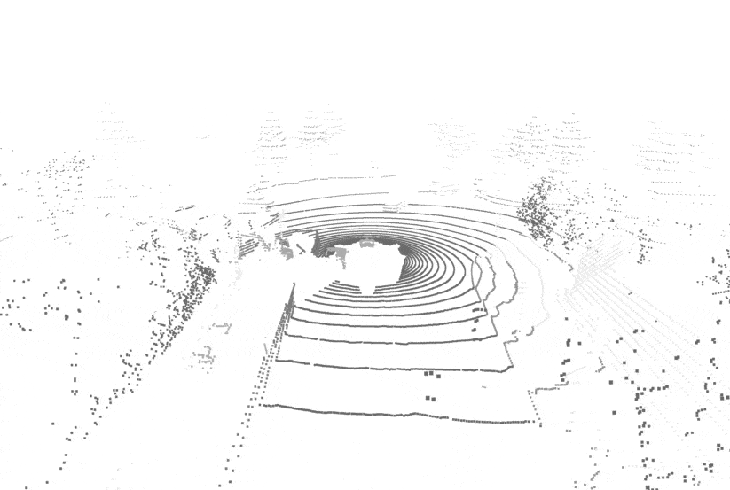 | 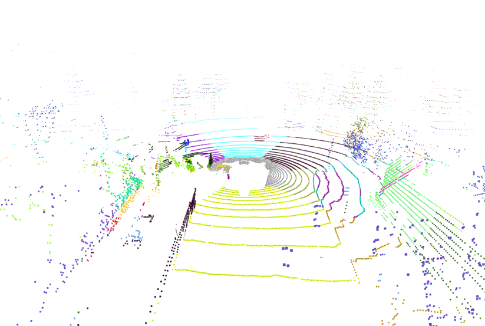 | 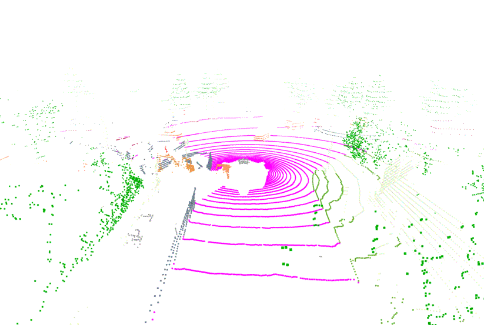 |
| |
| 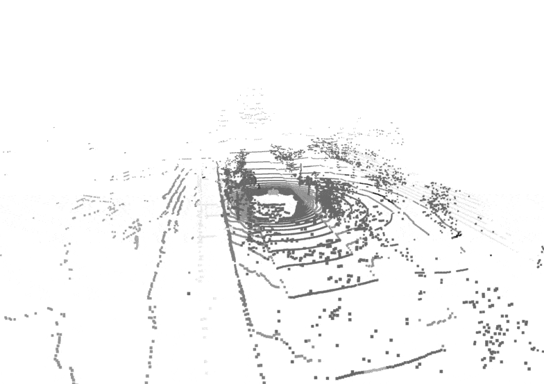 | 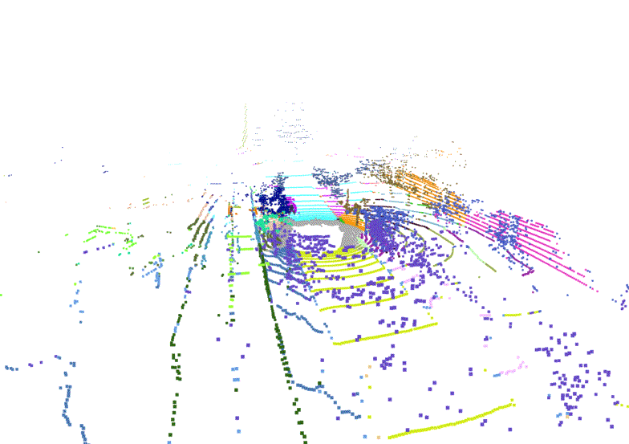 | 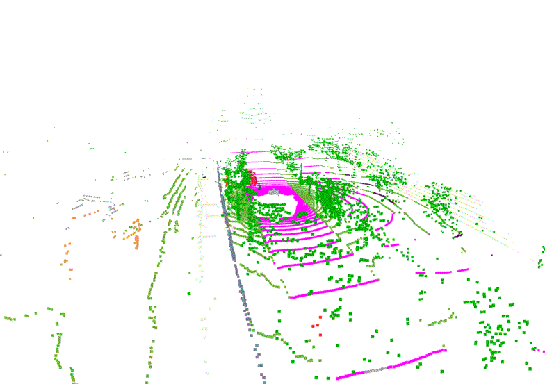 |
| |
| 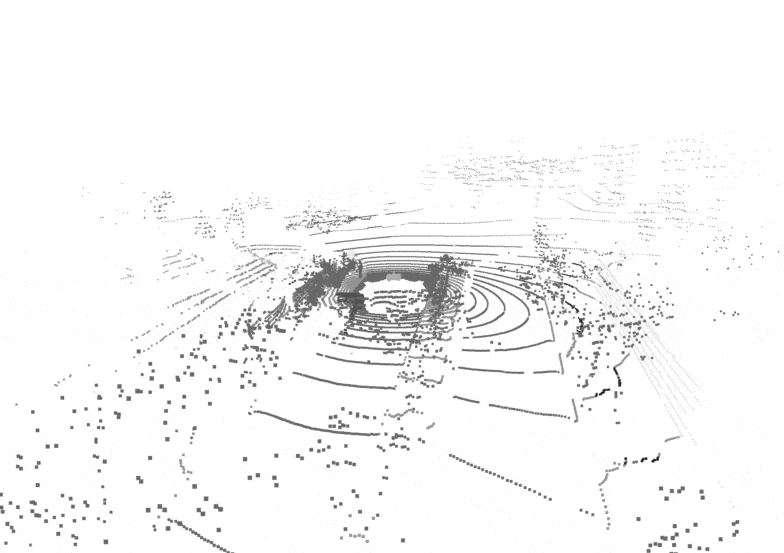 | 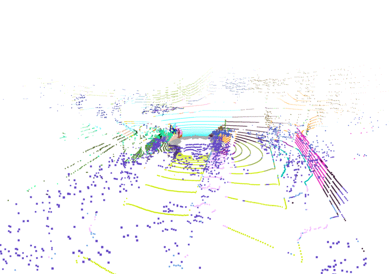 | 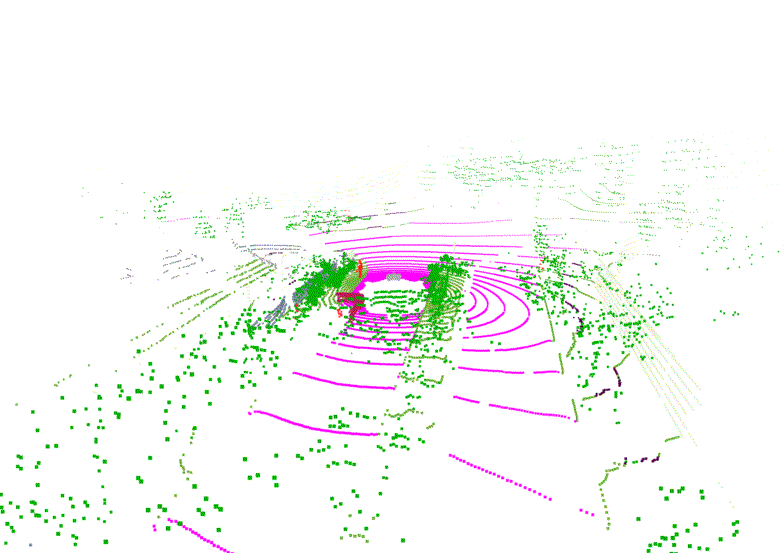 |

Kindly refer to [SUPERPOINT.md](docs/document/SUPERPOINT.md) for the details to generate the semantic superpixels & superpoints with vision foundation models.


## Getting Started
Kindly refer to [GET_STARTED.md](docs/document/GET_STARTED.md) to learn more usage about this codebase.


## Main Result

### :unicorn: Framework Overview

| 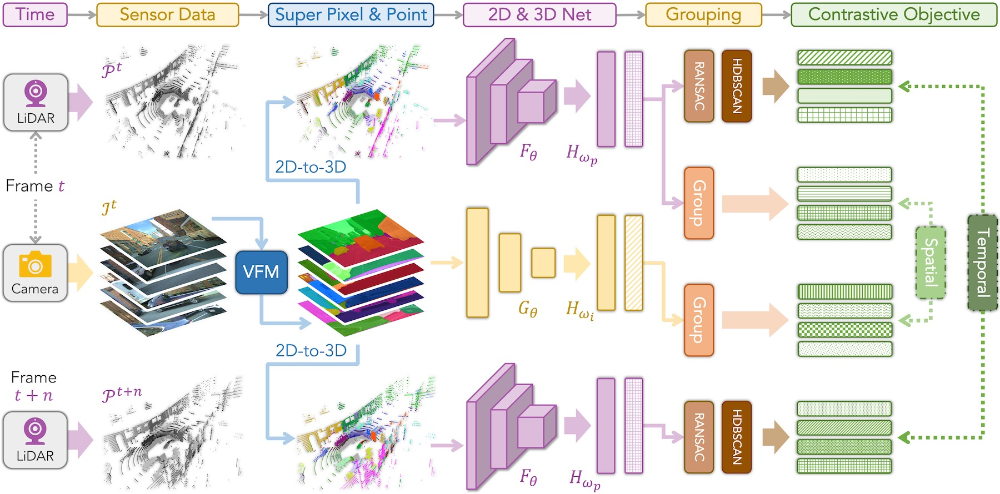 |
| :-: |
| Overview of the **Seal :seal:** framework. We generate, for each {LiDAR, camera} pair at timestamp t and another LiDAR frame at timestamp t + n, the semantic superpixel and superpoint by VFMs. Two pertaining objectives are then formed, including *spatial contrastive learning* between paired LiDAR and cameras features and *temporal consistency regularization* between segments at different timestamps. |

### :car: Cosine Similarity

| 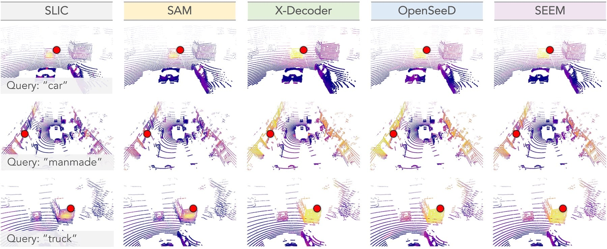 |
| :-: |
| The cosine similarity between a query point (red dot) and the feature learned with SLIC and different VFMs in our **Seal :seal:** framework. The queried semantic classes from top to bottom examples are: “car”, “manmade”, and “truck”. The color goes from violet to yellow denoting low and high similarity scores, respectively. |

### :blue_car: Benchmark

<table class="center">
   <tr>
      <th rowspan="2">Method</th>
      <th colspan="6">nuScenes</th>
      <th colspan="1">KITTI</th>
      <th colspan="1">Waymo</th>
      <th colspan="1">Synth4D</th>
   </tr>
   <tr>
      <td>LP</td> <td>1%</td> <td>5%</td> <td>10%</td> <td>25%</td> <td>Full</td>
      <td>1%</td> <td>1%</td> <td>1%</td>
   </tr>
   <tr>
      <td>Random</td>
      <td>8.10</td> <td>30.30</td> <td>47.84</td> <td>56.15</td> <td>65.48</td> <td>74.66</td>
      <td>39.50</td> <td>39.41</td> <td>20.22</td>
   </tr>
   <tr>
      <td>PointContrast</td>
      <td>21.90</td> <td>32.50</td> <td >-</td> <td>-</td> <td>-</td> <td>-</td>
      <td>41.10</td> <td>-</td> <td>-</td>
   </tr>
   <tr>
      <td>DepthContrast</td>
      <td>22.10</td> <td>31.70</td> <td>-</td> <td>-</td> <td>-</td> <td>-</td>
      <td>41.50</td> <td>-</td> <td>-</td>
   </tr>
   <tr>
      <td>PPKT</td>
      <td>35.90</td> <td>37.80</td> <td>53.74</td> <td>60.25</td> <td>67.14</td> <td>74.52</td>
      <td>44.00</td> <td>47.60</td> <td>61.10</td>
   </tr>
   <tr>
      <td>SLidR</td>
      <td>38.80</td> <td>38.30</td> <td>52.49</td> <td>59.84</td> <td>66.91</td> <td>74.79</td>
      <td>44.60</td> <td>47.12</td> <td>63.10</td>
   </tr>
   <tr>
      <td>ST-SLidR</td>
      <td>40.48</td> <td>40.75</td> <td>54.69</td> <td>60.75</td> <td>67.70</td> <td>75.14</td>
      <td>44.72</td> <td>44.93</td> <td>-</td>
   </tr>
   <tr>
      <td><strong>Seal :seal:</strong></td>
      <td>44.95</td> <td>45.84</td> <td>55.64</td> <td>62.97</td> <td>68.41</td> <td>75.60</td>
      <td>46.63</td> <td>49.34</td> <td>64.50</td>
   </tr>
</table>

### :bus: Linear Probing

| 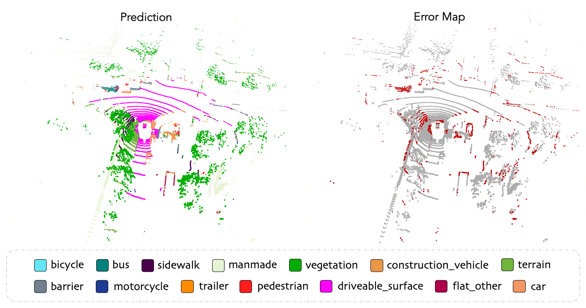 |
| :-: |
| The qualitative results of our **Seal :seal:** framework pretrained on nuScenes (without using groundtruth labels) and linear probed with a frozen backbone and a linear classification head. To highlight the differences, the correct / incorrect predictions are painted in gray / red, respectively. |

### :articulated_lorry: Downstream Generalization

<table class="center">
   <tr>
      <th rowspan="2">Method</th>
      <th colspan="2">ScribbleKITTI</th>
      <th colspan="2">RELLIS-3D</th>
      <th colspan="2">SemanticPOSS</th>
      <th colspan="2">SemanticSTF</th>
      <th colspan="2">SynLiDAR</th>
      <th colspan="2">DAPS-3D</th>
   </tr>
   <tr>
      <td>1%</td> <td>10%</td> <td>1%</td> <td>10%</td> <td>Half</td> <td>Full</td>
      <td>Half</td> <td>Full</td> <td>1%</td> <td>10%</td> <td>Half</td> <td>Full</td>
   </tr>
   <tr>
     <td>Random</td>
     <td>23.81</td> <td>47.60</td> <td>38.46</td> <td>53.60</td> <td>46.26</td> <td>54.12</td> <td>48.03</td> <td>48.15</td> <td>19.89</td> <td>44.74</td> <td>74.32</td> <td>79.38</td>
   </tr>
   <tr>
     <td>PPKT</td>
     <td>36.50</td> <td>51.67</td> <td>49.71</td> <td>54.33</td> <td>50.18</td> <td>56.00</td> <td>50.92</td> <td>54.69</td> <td>37.57</td> <td>46.48</td> <td>78.90</td> <td>84.00</td>
   </tr>
   <tr>
     <td>SLidR</td>
     <td>39.60</td> <td>50.45</td> <td>49.75</td> <td>54.57</td> <td>51.56</td> <td>55.36</td> <td>52.01</td> <td>54.35</td> <td>42.05</td> <td>47.84</td> <td>81.00</td> <td>85.40</td>
   </tr>
   <tr>
      <td><strong>Seal :seal:</strong></td>
      <td>40.64</td> <td>52.77</td> <td>51.09</td> <td>55.03</td> <td>53.26</td> <td>56.89</td> <td>53.46</td> <td>55.36</td> <td>43.58</td> <td>49.26</td> <td>81.88</td> <td>85.90</td>
   </tr>
</table>

### :truck: Robustness Probing

| Init | Backbone | mCE | mRR | Fog | Wet | Snow | Motion | Beam | Cross | Echo | Sensor |
| :--: | :--: | :--: | :--: | :--: | :--: | :--: | :--: | :--: | :--: | :--: | :--: 
| Random | [PolarNet](https://github.com/edwardzhou130/PolarSeg) | 115.09 | 76.34 | 58.23 | 69.91 | 64.82 | 44.60 | 61.91 | 40.77 | 53.64 | 42.01 |
| Random | [CENet](https://github.com/huixiancheng/CENet) | 112.79 | 76.04 | 67.01 | 69.87 | 61.64 | 58.31 | 49.97 | 60.89 | 53.31 | 24.78 |
| Random | [WaffleIron](https://github.com/valeoai/WaffleIron) | 106.73 | 72.78 | 56.07 | 73.93 | 49.59 | 59.46 | 65.19 | 33.12 | 61.51 | 44.01 |
| Random | [Cylinder3D](https://github.com/xinge008/Cylinder3D) | 105.56 | 78.08 | 61.42 | 71.02 | 58.40 | 56.02 | 64.15 | 45.36 | 59.97 | 43.03 |
| Random | [SPVCNN](https://github.com/mit-han-lab/spvnas) | 106.65 | 74.70 | 59.01 | 72.46 | 41.08 | 58.36 | 65.36 | 36.83 | 62.29 | 49.21 |
| Random | [MinkUNet](https://github.com/NVIDIA/MinkowskiEngine) | 112.20 | 72.57 | 62.96 | 70.65 | 55.48 | 51.71 | 62.01 | 31.56 | 59.64 | 39.41 |
| PPKT | [MinkUNet](https://github.com/NVIDIA/MinkowskiEngine) | 105.64 | 76.06 | 64.01 | 72.18 | 59.08 | 57.17 | 63.88 | 36.34 | 60.59 | 39.57 |
| SLidR | [MinkUNet](https://github.com/NVIDIA/MinkowskiEngine) | 106.08 | 75.99 | 65.41 | 72.31 | 56.01 | 56.07 | 62.87 | 41.94 | 61.16 | 38.90 |
| **Seal :seal:** | [MinkUNet](https://github.com/NVIDIA/MinkowskiEngine) | 92.63 | 83.08 | 72.66 | 74.31 | 66.22 | 66.14 | 65.96 | 57.44 | 59.87 | 39.85 |

### :tractor: Qualitative Assessment

| 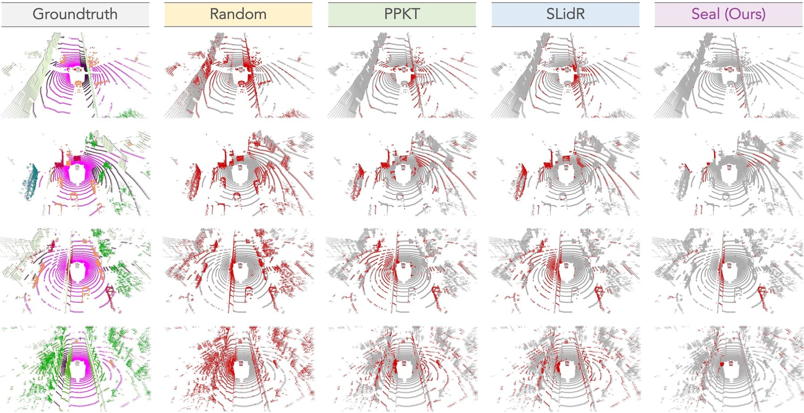 |
| :-: |
| The qualitative results of **Seal :seal:** and prior methods pretrained on nuScenes (without using groundtruth labels) and fine-tuned with 1% labeled data. To highlight the differences, the correct / incorrect predictions are painted in gray / red, respectively. |


## TODO List

- [x] Initial release. :rocket:
- [x] Add license. See [here](#license) for more details.
- [x] Add video demos :movie_camera:
- [x] Add installation details.
- [x] Add data preparation details.
- [ ] Add evaluation details.
- [ ] Add training details.


## Citation

If you find this work helpful, please kindly consider citing our paper:

```bibtex
@article{liu2023segment,
  title = {Segment Any Point Cloud Sequences by Distilling Vision Foundation Models},
  author = {Liu, Youquan and Kong, Lingdong and Cen, Jun and Chen, Runnan and Zhang, Wenwei and Pan, Liang and Chen, Kai and Liu, Ziwei},
  journal = {arXiv preprint arXiv:2306.09347}, 
  year = {2023},
}
```

```bibtex
@misc{liu2023segment_any_point_cloud,
  title = {The Segment Any Point Cloud Codebase},
  author = {Liu, Youquan and Kong, Lingdong and Cen, Jun and Chen, Runnan and Zhang, Wenwei and Pan, Liang and Chen, Kai and Liu, Ziwei},
  howpublished = {\url{https://github.com/youquanl/Segment-Any-Point-Cloud}},
  year = {2023},
}
```

## License
<a rel="license" href="http://creativecommons.org/licenses/by-nc-sa/4.0/"></a>
<br />
This work is under the <a rel="license" href="http://creativecommons.org/licenses/by-nc-sa/4.0/">Creative Commons Attribution-NonCommercial-ShareAlike 4.0 International License</a>.


## Acknowledgement
This work is developed based on the [MMDetection3D](https://github.com/open-mmlab/mmdetection3d) codebase.

><br>
> MMDetection3D is an open source object detection toolbox based on PyTorch, towards the next-generation platform for general 3D detection. It is a part of the OpenMMLab project developed by MMLab.

Part of this codebase has been adapted from [SLidR](https://github.com/valeoai/SLidR), [Segment Anything](https://github.com/facebookresearch/segment-anything), [X-Decoder](https://github.com/microsoft/X-Decoder), [OpenSeeD](https://github.com/IDEA-Research/OpenSeeD), [Segment Everything Everywhere All at Once](https://github.com/UX-Decoder/Segment-Everything-Everywhere-All-At-Once), [LaserMix](https://github.com/ldkong1205/LaserMix), and [Robo3D](https://github.com/ldkong1205/Robo3D).

:heart: We thank the exceptional contributions from the above open-source repositories!
